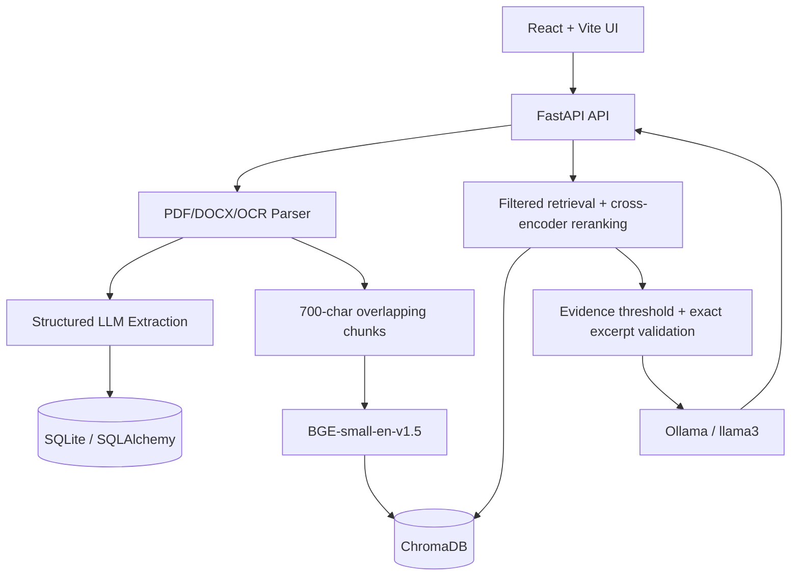

# ProcureSense

ProcureSense is an enterprise contract-intelligence platform for procurement and legal teams. It ingests PDF and DOCX agreements, extracts structured obligations, evaluates contract risk, and provides evidence-grounded natural-language Q&A.

## What It Does

- Ingests digital PDF, scanned PDF, and DOCX contracts.
- Extracts vendor, dates, renewal terms, SLAs, pricing, payment terms, termination, liability, compliance, and related clauses.
- Calculates a health score out of 100 and a Low, Medium, or High risk level.
- Stores searchable document chunks in ChromaDB using BGE embeddings.
- Answers questions with Ollama and validates cited excerpts against retrieved contract text.
- Supports contract-specific Q&A and contract-by-contract answers when the scope is All contracts.
- Shows renewal, SLA review, and price-escalation review events on the dashboard.
- Provides renewal alerts, risk distribution, SLA charts, contract details, and CSV reports.
- Enforces authenticated role access and contract ownership filtering.

## Architecture



## Technology

### Backend

- FastAPI and Uvicorn
- SQLite with SQLAlchemy
- ChromaDB persistent vector store
- LangChain text splitters
- Sentence-Transformers: `BAAI/bge-small-en-v1.5`
- Cross-encoder reranking: `cross-encoder/ms-marco-MiniLM-L-6-v2`
- Ollama with the `llama3` model
- PyMuPDF, `python-docx`, Pillow, and Tesseract OCR
- JWT authentication with `python-jose` and bcrypt password hashing

### Frontend

- React 19 with Vite
- React Router
- Recharts for dashboard visualizations
- Lucide React icons

## Setup

### Prerequisites

- Python 3.10 or newer
- Node.js 18 or newer
- Ollama installed locally
- Tesseract installed locally for scanned-PDF OCR

### Backend

```bash
python3 -m venv venv
source venv/bin/activate
pip install -r requirements.txt

ollama pull llama3
ollama serve
```

In another terminal, start the API when you are ready to run the application:

```bash
source venv/bin/activate
uvicorn api:app --reload
```

The API is available at `http://127.0.0.1:8000`. Interactive API documentation is available at `http://127.0.0.1:8000/docs`.

### Frontend

```bash
cd frontend
npm install
npm run dev
```

The Vite development UI runs at `http://localhost:5173`.

## Authentication and Access Control

| Role | Capabilities |
| --- | --- |
| Admin | View all contracts, upload, delete, chat, evaluate, and generate reports |
| Procurement | View owned contracts, upload, chat, evaluate, and generate reports |
| Legal | View owned contracts and chat |

Procurement and Legal users can register from the login page. Admin registration is intentionally disabled; the built-in administrator is provisioned directly.


Application data access is filtered by `uploaded_by`: administrators can access the complete workspace, while Procurement and Legal users can access contracts they uploaded. The same visibility policy is applied to the contract library, contract details, reports, renewal alerts, dashboard obligations, and chatbot source scope.

## Contract Processing

1. The upload endpoint accepts `.pdf` and `.docx` files.
2. PDF text is extracted with PyMuPDF. Low-text PDFs use the OCR fallback.
3. DOCX paragraphs and table cells are extracted with `python-docx`.
4. Ollama extracts the structured contract fields.
5. Labeled risk clauses are recovered from the full document so clauses outside the LLM context window are not lost.
6. Missing or failed extraction is kept as `Not specified`; extraction markers and empty documents are rejected.
7. Text is split into 700-character chunks with 150-character overlap.
8. Chunks are embedded and stored in ChromaDB with source-file metadata.

## Risk and Health Assessment

The health score is out of 100 and considers price escalation, SLA targets, and notice periods. Risk classification considers:

- High price escalation and low SLA commitments
- Very short notice periods
- Automatic renewal without a useful notice period
- Immediate, unilateral, discretionary, or no-cause termination rights
- Unfavorable liability limits, indemnity language, consequential damages, or strict caps
- Missing SLA penalties when the SLA is below target

Assessment is recalculated when contracts are uploaded and when existing contracts are loaded through the API, keeping the library and detail views consistent.

## Grounded Contract Q&A

The chatbot supports two scopes:

- A single selected contract
- All contracts visible to the current user

For each contract, the retrieval pipeline:

1. Filters ChromaDB by source file.
2. Retrieves candidate chunks and reranks them with a cross-encoder.
3. Applies an evidence threshold before invoking the LLM.
4. Requires the LLM to return exact citation excerpts.
5. Verifies every excerpt is a contiguous substring of retrieved text.
6. Removes duplicate citations and displays at most one supporting excerpt per contract.

When All contracts is selected, each visible contract receives an independent answer. Contracts without supporting evidence explicitly report that the information was not found on that contract.

## Dashboard and Obligations

The dashboard includes:

- Total contracts
- Average health score
- High-risk contract count
- Renewals within 90 days
- Risk distribution
- Vendor SLA commitments
- Obligation timeline entries for renewal, SLA review, and price-escalation review

The Renewal page groups alerts into critical, warning, and upcoming windows through 365 days. Dates that cannot be parsed are surfaced as review-needed obligations instead of silently disappearing.

## API Overview

| Method | Endpoint | Purpose |
| --- | --- | --- |
| `POST` | `/auth/login` | Authenticate a user |
| `POST` | `/auth/register` | Register a Procurement or Legal user |
| `POST` | `/upload` | Upload and analyze a PDF or DOCX |
| `GET` | `/contracts` | List visible contracts |
| `GET` | `/contracts/{id}` | View one visible contract |
| `GET` | `/contracts/report/all` | Export visible contracts as CSV |
| `GET` | `/contracts/{id}/report` | Export one visible contract as CSV |
| `GET` | `/alerts` | Get visible renewal alerts |
| `GET` | `/obligations` | Get visible renewal, SLA, and price events |
| `POST` | `/chat` | Ask an evidence-grounded question |
| `POST` | `/evaluate` | Run the evaluation workflow for authorized roles |
| `GET` | `/auth/me` | Inspect the authenticated user |

## Repository Layout

```text
.
├── api.py                  # FastAPI routes, authorization, upload, chat, reports
├── auth.py                 # JWT, password hashing, signup, role permissions
├── contract_parser.py      # PDF, DOCX, and OCR text extraction
├── extractor.py            # Structured LLM extraction and field fallback logic
├── risk.py                 # Risk classification and unified assessment
├── score.py                # Health score calculation
├── rag_engine.py           # Filtered retrieval, evidence gate, citation validation
├── chunker.py              # Overlapping document chunks
├── embeddings.py           # BGE embeddings
├── reranker.py             # Cross-encoder reranking
├── vector_store.py         # ChromaDB persistence and source filtering
├── database.py             # SQLAlchemy models and persistence
├── alerts.py               # Renewal window calculations
├── report_generator.py     # CSV and summary reports
├── contracts/              # Uploaded files and high-risk fixtures
├── data/                   # SQLite database
├── chroma_db/              # Persistent ChromaDB data
└── frontend/               # React application
```

## Included Fixtures

The `contracts/` directory includes representative fixtures for testing analysis:

- `High_Risk_Contract.docx`
- `High_Risk_Supplier_Agreement.pdf`
- `High_Risk_Data_Processing_Addendum.pdf`
- `Low_Risk_Contract.docx`

The high-risk fixtures intentionally contain combinations such as severe escalation, poor SLA, short notice, discretionary termination, indemnity, and restrictive liability terms.

## Validation

Backend syntax can be checked without starting the application:

```bash
./venv/bin/python -m py_compile api.py rag_engine.py risk.py score.py extractor.py database.py
```

Frontend production build:

```bash
cd frontend
npm run build
```

## Known Limitations

- OCR requires a working local Tesseract installation and Pillow dependencies.
- Price events currently represent review dates and escalation clauses; the system does not forecast future monetary amounts without a structured base price and escalation schedule.
- The SQLite schema stores extracted dates as strings, so unusual date formats may require manual review.
- No automated test suite is currently included; focused compilation, extraction, citation, access-control, and frontend build checks are used during development.
