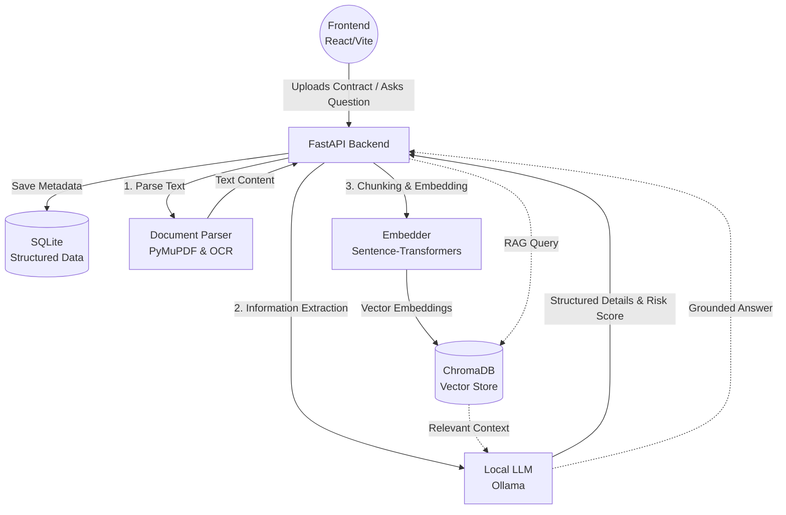

# ProcureSense

<p align="center">
  <em>AI-Powered Enterprise Procurement Contract Intelligence Platform</em>
</p>

## Overview

**ProcureSense** is a comprehensive contract intelligence application designed to automate the analysis of procurement contracts. By leveraging local Large Language Models (LLMs) and Retrieval-Augmented Generation (RAG), ProcureSense allows users to upload contracts, automatically extract key metadata (SLAs, renewal dates, clauses), analyze risks, and seamlessly chat with their documents to retrieve instant, cited answers.

---

## Architecture & Flowchart



---

## Tech Stack

### Backend & AI Engine
* **Core Framework:** FastAPI
* **Relational Database:** SQLite (via SQLAlchemy)
* **Vector Database:** ChromaDB 
* **AI Orchestration:** Langchain
* **Local LLM Execution:** Ollama
* **Embeddings:** Sentence-Transformers
* **Document Processing:** PyMuPDF, `python-docx`, pytesseract (for OCR capabilities)
* **Authentication:** JWT, passlib, python-jose

### Frontend UI
* **Framework:** React 19 (via Vite)
* **Routing:** React Router
* **Visuals & Animations:** Framer Motion
* **Charts/Analytics:** Recharts
* **Icons:** Lucide React, React Icons

---

## Repository Structure

* **`/` (Root):** FastAPI backend containing all the AI processing logic, RAG engine, authentication, and API routes.
* **`/frontend`:** The React frontend application.
* **`/contracts`:** Storage directory for uploaded user contracts (PDF, DOCX).
* **`/data`:** Directory where the SQLite relational database is stored.
* **`/chroma_db`:** Persistent storage directory for ChromaDB vector embeddings.

---

## Setup & Installation

### Prerequisites
- **Python 3.9+**
- **Node.js 18+**
- **[Ollama](https://ollama.ai/)** (Must be installed and running locally for the AI pipeline to function)

### 1. Backend Setup

1. Navigate to the project root directory.
2. Create and activate a Python virtual environment:
   ```bash
   python -m venv .venv
   source .venv/bin/activate  # On Windows use: .venv\Scripts\activate
   ```
3. Install the required dependencies:
   ```bash
   pip install -r requirements.txt
   ```
4. Run the FastAPI development server:
   ```bash
   uvicorn api:app --reload
   ```
   *The backend API will be available at `http://127.0.0.1:8000`.*

### 2. Frontend Setup

1. Navigate to the frontend directory:
   ```bash
   cd frontend
   ```
2. Install Node dependencies:
   ```bash
   npm install
   ```
3. Start the Vite development server:
   ```bash
   npm run dev
   ```
   *The frontend UI will be available at `http://localhost:5173`.*

---

## Key Features

- **Smart Contract Parsing:** Automatically detects and accurately parses text from both text-based and scanned PDFs, as well as Word documents.
- **AI-Powered Extraction:** Automatically extracts up to 15 structured fields instantly, including vendor names, renewal dates, financial terms, and SLAs.
- **Risk Assessment:** Calculates a composite risk score based on SLA thresholds, price escalation limits, and termination clauses.
- **Grounded RAG Chat:** Conversational interface allowing users to query multiple contracts using semantic search. Every answer includes source citations to the original document.
- **Analytics Dashboard:** Visual insights and comparisons of SLAs, price escalations, and expiring contracts.
- **Export Reports:** Generate and download comprehensive CSV reports containing all parsed contract data.
